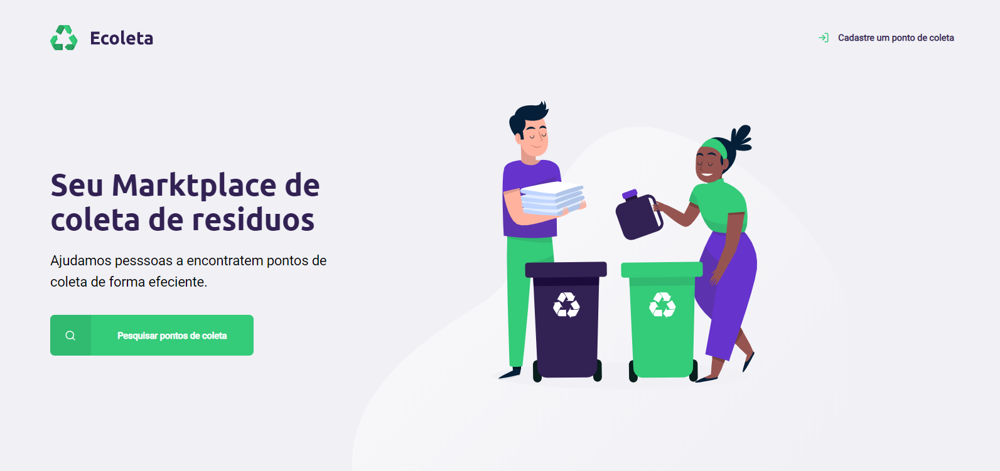

<h3 align="center">
    
    <br><br>
    <br>
</h3>


[](https://github.com/AntonioSilvaAzevedo)


 
The <strong>Ecoleta</strong> is a Web application to help people find collection points for recycling.

## :rocket: This project was developed during the NLW week at Rocketseat.


## :fire: How to use

  - install the **[Node.js](https://nodejs.org/en/)** on your machine

1. clone this repository.

```sh
  $ git clone git@github.com:AntonioSilvaAzevedo/Ecoleta-starter.git
```

2. install the dependencies:

```sh
  # Instale as dependências
  $ npm install


  # start the server
  $ npm run dev

  # open the path in the browser
  $ localhost: 3333

```

# :heavy_check_mark: preview page-home

<h1 align="center">
    
</h1>


<h4 align="center">
    written by <a href="https://www.linkedin.com/in/antonio-carlos-44b106129/" target="_blank">Antonio Carlos</a>
</h4>

